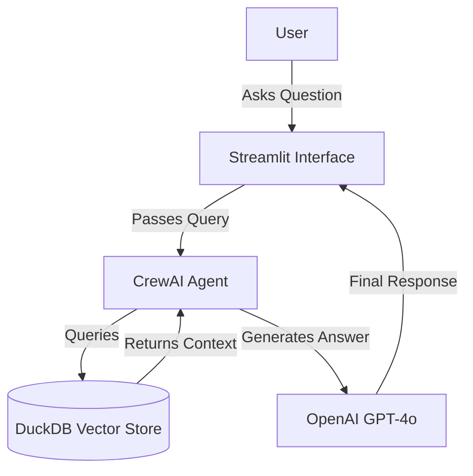

# 🏀 NBA RAG Assistant

**A Retrieval-Augmented Generation (RAG) agent designed to answer complex questions about the past two NBA seasons using verified data sources.**

---

## 📌 Project Overview & Problem Statement

### The Problem
NBA fandom relies heavily on scattered information, for example, statistical databases, news articles, and historical records. Finding a coherent answer that synthesizes "what happened" (narrative) with "what the numbers say" (statistics) is difficult using standard search engines or generic LLMs, which often hallucinate scores or outdated roster moves.

### The Solution
The **NBA RAG Assistant** is a specialized AI agent that bridges this gap. By ingesting a curated dataset of official player statistics and analytical articles from the 2023-2025 seasons, this system allows users to query a private knowledge base. It delivers accurate, sourced answers by retrieving exact context before generating a response.

---

## 🏗️ Architecture & Pipeline

This project uses a modular **RAG (Retrieval-Augmented Generation)** pipeline to ensure accuracy and transparency.

### Data Flow Overview
1.  **Ingestion:** Raw text data (articles) and structured data (stats) are cleaned and chunked.
2.  **Embedding:** Text chunks are converted into vector embeddings using `SentenceTransformers`.
3.  **Storage:** Vectors are stored in a local **DuckDB** database for efficient similarity search.
4.  **Retrieval:** When a user asks a question, the system queries DuckDB for the top *k* most relevant chunks.
5.  **Generation:** A **CrewAI** agent receives the context and the question, then synthesizes a natural language answer using OpenAI's `gpt-4o`.
6.  **Interface:** The entire process is accessible via a **Streamlit** web app.

### Pipeline Diagram


## 📂 Document Collection & Justification

To ensure comprehensive coverage of the NBA landscape, I curated a diverse dataset consisting of two distinct data types:

| Data Source | Content Type | Justification |
| :--- | :--- | :--- |
| **Player & Team Statistics** | Structured Data | CSV and Excel exports of player/team stats from the 2023-24, 2024-25 seasons, and the beginning of the 2025-26 season. Essential for answering quantitative questions (e.g., "Who led the league in assists?"). |
| **News & Analysis Articles** | Unstructured Text | Curated articles covering trades, injuries, and playoff results. These provide the narrative context that raw numbers miss, allowing the agent to explain *why* a team won or lost. |

**Preprocessing Strategy:**
* **Cleaning:** All documents were cleaned to remove HTML artifacts, extraneous headers, and irrelevant metadata.
* **Chunking:** Large texts were split into overlapping chunks to ensure the retriever captures full semantic meaning without exceeding token limits.

## 🤖 Agent Configuration

The core of this application is a custom **CrewAI Agent** configured with specific instructions to act as a reliable domain expert.

* **Role:** `NBA Content Assistant`
* **Goal:** "Provide answers ONLY if they are explicitly found in the retrieved context, but report the answers as a succinct summary of database material"
* **Backstory:** "You are a assistant who verifies facts against a provided database. Your database ONLY contains data from the 2023-2024, 2024-2025, and 2025-26 seasons (only the beginning of the 2025-26 season). If the user asks about a year in the future (e.g., 2030), you MUST say: I cannot answer this as it is in the future. If the retrieved context does not contain the answer, do not guess. State: The provided documents do not contain this information. Ignore your internal knowledge about the NBA. Only use the retrieved passages."

### Rationale
A generic AI assistant often prioritizes fluency over fact, which leads to hallucinations in sports analysis. By configuring the agent with this specific persona, I enforce a constraint: the agent must act as a **researcher first**, prioritizing the retrieved context over its pre-trained general knowledge. The instruction to "never guess" and "admit missing data" is crucial for maintaining user trust in a factual RAG system.

## 🚀 Installation & Setup

Follow these steps to run the project locally.

### 1. Clone the Repository
```bash
git clone [https://github.com/jmikovits/Mikovits-NLP-Portfolio/Mikovits_LPP_RAG.git](https://github.com/jmikovits/Mikovits-NLP-Portfolio/Mikovits_LPP_RAG.git)
cd NBA-RAG-Assistant
```
### 2. Create a Virtual Environment
```bash
# Windows
conda create -n nba_rag python=3.10
conda activate nba_rag
```
### 3. Install Dependencies
```bash
pip install -r requirements.txt
```
### 4. Configure API Keys
This project requires an OpenAI API Key.
You can enter your key directly in the Streamlit sidebar when the app launches.
Alternatively, set it in your environment: set OPENAI_API_KEY=sk-...

### 5. Run the Application
``` bash
python -m streamlit run app.py
```

## 🌐 Streamlit Deployment

The application is deployed and accessible via Streamlit Cloud.

👉 **[Link to Live App](https://mikovits-nlp-portfolio-qldrdcy8ey4kabukwjqjgc.streamlit.app/)**
